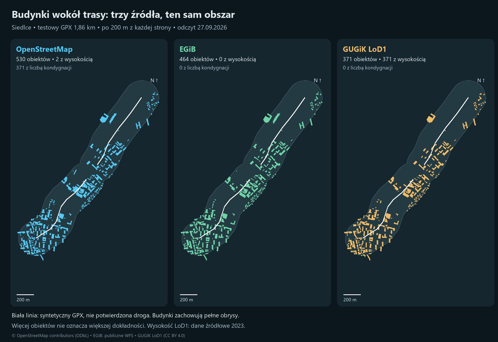

# Budynki do widoku kierowcy — porównanie rzeczywistych danych

Odczyt: 27 września 2026. Obszar: Siedlce i skraj powiatu siedleckiego. Status: analiza danych, bez wdrożenia do aplikacji.

## Rekomendacja

**Zachować OSM jako podstawę obrysów, zachowywać wysokości i kondygnacje w kaflach, a LoD1 GUGiK traktować jako dodatkowe źródło wysokości. EGiB przydaje się do kontroli i uzupełniania obrysów, ale w tej próbce nie daje wysokości.** Nie ma tu uzasadnienia, aby zaczynać od integracji BDOT500.

To rekomendacja dla przebadanego fragmentu, nie dowód jakości w całej Polsce. Nie porównywano bezpośrednio BDOT500 ani nie sprawdzano budynków w terenie. Większa liczba obiektów nie oznacza większej dokładności: źródła inaczej dzielą zabudowę, mogą zawierać obiekty nieaktualne i różne definicje budynku.

## Co zmierzono

Użyto istniejącego `test_mazovia.gpx`: **1,863 km w dwóch oddzielnych segmentach**, bufor 200 m na każdą stronę, 0,952 km². To syntetyczny plik testowy, nie potwierdzona przejezdna droga. Segmentów nie połączono sztuczną linią. Wszystkie źródła filtrowano tym samym korytarzem. Obiekt liczono, jeśli jego obrys przecina korytarz; zachowano cały obrys.

| Źródło | Obiekty | Wysokość w metrach | Liczba kondygnacji | GeoJSON po gzip |
|---|---:|---:|---:|---:|
| OSM, bieżące publiczne dane | 530 | 2 (0,4%) | 371 (70,0%) | 39 069 B |
| EGiB, dwie publiczne usługi WFS | 464 | 0 | 0 | 56 998 B |
| GUGiK LoD1, wydanie 2024 | 371 | 371 (100%) | 0 | 57 076 B |

Rozmiary dotyczą **lokalnych wycinków GeoJSON z atrybutami diagnostycznymi**, kompresowanych gzip. Nie są rozmiarami PMTiles, pamięci GPU ani pomiarem wydajności Androida. Zestawy mają różne dodatkowe atrybuty, więc tabela nie porównuje samej efektywności kompresji geometrii. Pełne źródłowe ZIP-y LoD1 dla miasta i powiatu mają łącznie 20 227 266 B; na urządzenie powinien trafiać przygotowany wycinek lub kafle, nie CityGML całego powiatu.

## Czy obrysy pasują do siebie?

Porównano przecięcie powierzchni obrysów do powierzchni ich sumy (IoU). Próg dopasowania wynosi 0,5; pary wybierano zachłannie od największego IoU, jeden obiekt do jednego. Nie łączono automatycznie układów jeden-do-wielu.

| Para | Dopasowane pary | Mediana IoU | Mediana odległości środków | 95. percentyl odległości środków |
|---|---:|---:|---:|---:|
| OSM – EGiB | 426 | 0,997 | 0,009 m | 0,267 m |
| LoD1 – EGiB | 341 | 0,999 | 0,003 m | 1,504 m |
| OSM – LoD1 | 346 | 0,995 | 0,018 m | 1,823 m |

To **zgodność zapisanych geometrii, a nie dokładność względem świata rzeczywistego**. Bardzo małe różnice mogą wynikać ze wspólnego pochodzenia obrysów. EGiB nie potraktowano jako bezbłędnej prawdy referencyjnej.

OSM dopasowuje się do 426 z 464 obiektów EGiB (91,8%). LoD1 można dopasować do 346 z 530 obiektów OSM (65,3%) przy tym progu. Pozostałych wysokości nie wolno automatycznie przypisywać po samym najbliższym środku. Przykładowo jeden większy obiekt LoD1 może obejmować kilka obrysów innego źródła.

## Aktualność i wysokości

- OSM: daty ostatniej edycji obiektów od 2011-02-03 do 2026-09-22. Data edycji nie jest datą pomiaru i nie dowodzi aktualności każdego atrybutu. Migawka Overpass: 2026-09-27T21:25:36Z.
- LoD1: **wydanie paczki 2024, a `aktZrodla` wszystkich 371 obiektów wskazuje 2023**. Wersje danych obrysów: 326 obiektów z 2021-11-15, 26 z 2018-12-12, 6 z 2019-07-02 i 13 z 2022-10-27. Wysokość jest atrybutem modelu, nie pomiarem wykonanym w dniu audytu.
- W LoD1 maksymalna różnica `measuredHeight` względem pionowego zakresu bryły wynosiła 0,005 m. To kontrola spójności pliku, nie walidacja wysokości w terenie.
- EGiB: w pobranych obiektach brak wysokości i wartości kondygnacji. Znacznik czasu odpowiedzi WFS nie zastępuje daty aktualizacji poszczególnego budynku.

## Ważny problem z pobieraniem EGiB

Usługa zbiorcza zwróciła 906 obiektów w prostokącie zapytania: 866 z miasta i 40 z powiatu. Bezpośrednia usługa miasta zwróciła 3319 obiektów dla tego samego prostokąta. **Usługa zbiorcza pominęła znaczną część miasta**, choć zadeklarowane `numberMatched` i `numberReturned` były równe. Przyczyny nie ustalono; sam licznik odpowiedzi nie gwarantuje pokrycia całego obszaru.

Połączono odpowiedzi po `ID_BUDYNKU`, usuwając 866 powtórzeń. Pierwszeństwo miała geometria usługi zbiorczej. Powtórzone obrysy różniły się drobno zapisem współrzędnych; maksymalna powierzchnia różnicy symetrycznej wyniosła 0,2351 m² w EPSG:3857 (to metry projekcji Mercatora, nie powierzchnia terenowa). W końcowym korytarzu pozostało 450 obiektów miasta i 14 powiatu. Żadnego powtórzonego ID nie naliczono dwa razy.

LoD1 pobrano dla **obu** jednostek: 1464 i 1426. Sama paczka miasta dawała 358 obiektów; powiat dodał 13. Dzięki temu różnic nie przypisano błędnie brakowi budynków w LoD1.

## Co to oznacza dla MazoviaOffroad

Obecny `tools/tiles/process.lua` zapisuje geometrię warstwy `building`, ale nie kopiuje `height` ani `building:levels`. `tools/tiles/config.json` ustawia jej zakres zoomu 13–14, a `app/src/main/assets/mapstyles/mazovia_offroad_v1.json` wyświetla ją jako płaskie wypełnienie. Wyniki powyżej dotyczą **świeżego OSM z Overpass, nie paczki zainstalowanej na telefonie**. Lokalnie nie znaleziono polskiej paczki pozwalającej potwierdzić jej aktualną zawartość.

Proponowana kolejność przyszłego wdrożenia:

1. Zachować w przygotowywanych kaflach poprawnie parsowane `height`, `min_height`, `building:levels` i pochodzenie wysokości. Przebudować mały obszar próbny, nie całą bibliotekę map.
2. Rysować proste bryły z rzeczywistych obrysów. Brak wysokości oznacza wartość nieznaną, nie 0 m. Wysokość z liczby kondygnacji jest estymacją i powinna mieć oznaczenie jakości danych; przykładowy mnożnik metrów na kondygnację wymaga decyzji, nie jest pomiarem.
3. Przygotować LoD1 poza telefonem. Dopasowywać wysokości wyłącznie do wystarczająco zgodnych obrysów, sprawdzając podziały budynków i daty źródeł. Przy konflikcie świeżego jawnego atrybutu OSM ze starszym LoD1 nie nadpisywać bezwarunkowo. Zachować datę, źródło i metodę estymacji.
4. Osadzać bryły względem tego samego modelu terenu i układu wysokości co scena. LoD1 zawiera wysokość podstawy w układzie pionowym wskazanym przez CityGML; nie wolno mieszać jej bezpośrednio z dowolnym DEM lub wysokością GPS. Wysokość bryły względem podstawy to osobna wielkość.
5. Buforować kafle i ograniczać szczegółowość oraz zasięg budynków. Sprawdzić płynność, pamięć, transfer i energię na docelowym telefonie. Nie odpytywać WFS/Overpass dla każdej klatki lub pozycji GPS.

Koszt samych danych dla tego wycinka jest niewielki. **Nie zmierzono kosztu renderowania**: liczby obiektów i kilobajtów nie można przeliczyć na FPS. Widok kierowcy wymaga też prawdziwego terenu, poprawnej kamery, geometrii dróg i zasłaniania obiektów. Budynki nie rozwiązują tych elementów samodzielnie.

## Pliki i powtarzalność

- `comparison.png`: mapa do szybkiego pokazania wyników.
- `metrics.json`: liczby bez zaokrąglania do tabeli.
- `area.json`: dokładny wspólny obszar i oba segmenty GPX.
- `osm.geojson`, `egib.geojson`, `lod1.geojson` i wersje `.gz`: odfiltrowane obrysy w WGS84. Brak nazw użytkowników i identyfikatorów kont z odpowiedzi OSM.
- `AI-HANDOFF.md`: zakres i instrukcja przekazania wyników kolejnemu modelowi.
- `*.provenance.json`: adresy, parametry zapytań, czas pobrania, rozmiar i SHA-256.
- `building-source-audit-share.zip`: raport, mapa, wyniki, obszar, wycinki i metadane pochodzenia; bez surowej odpowiedzi OSM i pełnych paczek powiatowych.

Skrypty znajdują się w `tools/building-source-audit/`: `collect.py`, `lod1_index.py`, `analyze.py`, `render.py`, `verify.py`. Wymagają Python, Shapely, pyproj i Pillow. Lokalne biblioteki Shapely/pyproj zainstalowano wyłącznie do `.tmp-building-source-audit/packages`; nie dodano zależności aplikacji. `collect.py` pobiera podstawowe dane i zapisuje żądania, pozostałe pobrania są odtwarzalne z metadanych; `analyze.py` i `render.py` pracują na lokalnym cache.

Obliczenia powierzchni i dopasowania wykonano w EPSG:2180. CityGML odczytano jako XYZ zgodnie z wartościami współrzędnych, a WFS jako XY EPSG:3857. Obrysy LoD1 pochodzą z najniższych poziomych powierzchni brył. OSM obsługuje domknięte ways oraz relacje multipolygon, bez podwójnego liczenia ich zewnętrznych ways. W tej próbce parser nie zgłosił napraw, niedomkniętych obrysów ani braku podstaw brył. Szczegóły ograniczeń dopasowania opisano powyżej.

## Źródła i przypisanie autorstwa

- © OpenStreetMap contributors, [ODbL i zasady przypisania](https://www.openstreetmap.org/copyright); odczyt przez [Overpass API](https://overpass-api.de/).
- GUGiK: [modele 3D budynków](https://www.geoportal.gov.pl/pl/dane/inne-dane/modele-3d-budynkow/), [indeks WMS](https://mapy.geoportal.gov.pl/wss/service/PZGIK/FOTO/WMS/ModeleBudynkow3D?service=WMS&request=GetCapabilities), paczki [miasto Siedlce 1464](https://opendata.geoportal.gov.pl/InneDane/Budynki3D/LOD1/2024/14/1464.zip) i [powiat siedlecki 1426](https://opendata.geoportal.gov.pl/InneDane/Budynki3D/LOD1/2024/14/1426.zip). Indeks przypisuje im [CC BY 4.0](https://creativecommons.org/licenses/by/4.0/). Wycinki zostały przetworzone: wybrano obrysy podstaw, przeliczono współrzędne i ograniczono obszar.
- EGiB: [publiczny WFS miasta Siedlce](https://siedlce.geoportal2.pl/map/geoportal/wfse.php?service=WFS&request=GetCapabilities), [zbiorczy WFS GUGiK](https://mapy.geoportal.gov.pl/wss/service/PZGIK/EGIB/WFS/UslugaZbiorcza?service=WFS&request=GetCapabilities). Nie przypisano tym danym automatycznie licencji LoD1. Przed produkcyjną dystrybucją pakietu ustalić właściwe warunki ponownego wykorzystania i zachować wymagane przypisanie.

Źródła zachowano oddzielnie. Audyt nie rozstrzyga zgodności licencyjnej przyszłej połączonej bazy ani nie jest publikacją takiej bazy. Nie zmieniono kodu produkcyjnego aplikacji.
